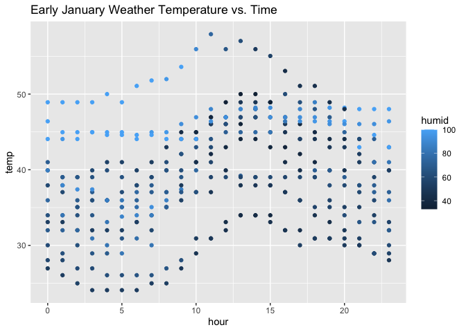

p8105_hw1_sw3879
================
Siqing Wang
2023-09-18

## Problem 1

Importing the moderndive tidyverse library

``` r
library(moderndive)
data("early_january_weather")
library(tidyverse)
```

The early January weather dataset contains 358 rows and 15 columns.

This dataset contains the following variables: origin, year, month, day,
hour, temp, dewp, humid, wind_dir, wind_speed, wind_gust, precip,
pressure, visib, time_hour.

By viewing this dataset, there are missing values in the wind_gust and
pressure column that might impact later analyses.

The mean temperature is 39.58

``` r
library(ggplot2)
ggplot(early_january_weather, aes(x = hour, y = temp, color = humid)) + geom_point() + labs(title = "Early January Weather Temperature vs. Time")
```

<!-- -->

``` r
ggsave(filename = "HW1_problem1_plot.pdf")
```

There are two patterns evidenced by the plot:

1)  From 0 to 5hr, temperature generally decreases and reaches the
    lowest point. From 5hr to 13hr, temperature generally increases and
    reaches the peak. Starting from 13-15hr, temperature drops again.

2)  On days with higher humidity, temperature tends to be higher; on
    days with lower humidity, temperature tends to be lower.

## Problem 2

Constructing the dataframe and taking the mean of each column

``` r
p2_df = tibble(
  rs = rnorm(10, mean = 0, sd = 1),
  log = rs > 0,
  char = c("a", "b", "c", "d", "e", "f", "g", "h", "i", "j"),
  fac = factor(c("high", "high", "high", "medium", "medium", "medium", "medium", "low", "low", "low"))
)
mean(pull(p2_df, rs))
```

    ## [1] -0.6104708

``` r
mean(pull(p2_df, log))
```

    ## [1] 0.4

``` r
mean(pull(p2_df, char))
```

    ## Warning in mean.default(pull(p2_df, char)): argument is not numeric or logical:
    ## returning NA

    ## [1] NA

``` r
mean(pull(p2_df, fac))
```

    ## Warning in mean.default(pull(p2_df, fac)): argument is not numeric or logical:
    ## returning NA

    ## [1] NA

Mean can be calculated from the random sample and the logical vector,
but not the character or factor vector.

Next, converting the logical, character, and logical vector into numeric

``` r
as.numeric(pull(p2_df, log))
as.numeric(pull(p2_df, char))
as.numeric(pull(p2_df, fac))
```

The logical and factor vectors can be coerced into numeric format, but
not the character vector. This is because the factor vector is assessed
based on the alphabetical order for the first letter of each level, but
this did not happen with the character vector.
