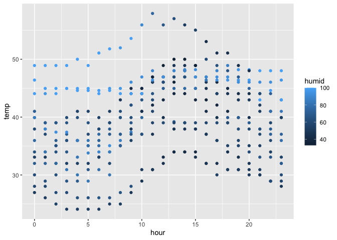

p8105_hw1_sw3879
================
Siqing Wang
2023-09-18

## Problem 1

``` r
library(moderndive)
data("early_january_weather")
library(tidyverse)
```

    ## ── Attaching core tidyverse packages ──────────────────────── tidyverse 2.0.0 ──
    ## ✔ dplyr     1.1.3     ✔ readr     2.1.4
    ## ✔ forcats   1.0.0     ✔ stringr   1.5.0
    ## ✔ ggplot2   3.4.3     ✔ tibble    3.2.1
    ## ✔ lubridate 1.9.2     ✔ tidyr     1.3.0
    ## ✔ purrr     1.0.2     
    ## ── Conflicts ────────────────────────────────────────── tidyverse_conflicts() ──
    ## ✖ dplyr::filter() masks stats::filter()
    ## ✖ dplyr::lag()    masks stats::lag()
    ## ℹ Use the conflicted package (<http://conflicted.r-lib.org/>) to force all conflicts to become errors

The early January weather dataset contains 358 rows and 15 columns,
encompassing time- and location-specific weather information regarding
temperature, wind, humidity, precipitation, pressure, and visibility.

missing data?

The mean temperature is 39.5821229 \#round this

``` r
library(ggplot2)
ggplot(early_january_weather, aes(x = hour, y = temp, color = humid)) + geom_point()
```

<!-- -->

``` r
#ggsave
```

## Problem 2

``` r
p2_df = tibble(
  rs = rnorm(10, mean = 0, sd = 1),
  log = rs > 0,
  char = c("a", "b", "c", "d", "e", "f", "g", "h", "i", "j"),
  fac = factor(c("high", "high", "high", "medium", "medium", "medium", "medium", "low", "low", "low"))
)
mean(pull(p2_df, rs))
```

    ## [1] -0.05472535

``` r
mean(pull(p2_df, log))
```

    ## [1] 0.6

``` r
mean(pull(p2_df, char))
```

    ## Warning in mean.default(pull(p2_df, char)): argument is not numeric or logical:
    ## returning NA

    ## [1] NA

``` r
mean(pull(p2_df, fac))
```

    ## Warning in mean.default(pull(p2_df, fac)): argument is not numeric or logical:
    ## returning NA

    ## [1] NA

Mean can be calculated from the random sample and the logical vector,
but not the character or factor vector.

``` r
as.numeric(pull(p2_df, log))
as.numeric(pull(p2_df, char))
as.numeric(pull(p2_df, fac))
```

The logical and factor vectors can be coerced into numeric format, but
not the character vector.
